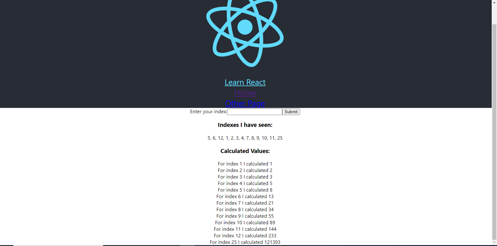

# TRABAJO FINAL 

## Nombre
    Jose Manuel Nuñez Reyes

## Matricula 
    2021-0233

## Materia
    Analisis De Sistemas

## Maestro 
    Lizandro José Ramírez Difo

## Fecha
    09/04/2023

# Introducción
La aplicación descrita es un ejemplo de una aplicación de varias capas que utiliza las  tecnologías React, Node.js, Express, PostgreSQL, Redis y Nginx. Esta aplicación permite calcular la serie de Fibonacci de un número determinado a través de una API, almacenar los resultados en una base de datos PostgreSQL y en caché en Redis para acelerar el acceso a los resultados en el futuro. También utiliza un servidor proxy Nginx para enrutar las solicitudes del cliente y de la API a sus respectivos servidores.

# Marco teórico
La aplicación utiliza Node.js y Express como servidor web para crear la API. La base de datos PostgreSQL se utiliza para almacenar los valores de la serie de Fibonacci. La caché Redis se utiliza para almacenar en caché los valores de la serie de Fibonacci y acelerar su acceso en el futuro. El servidor proxy Nginx se utiliza para enrutar las solicitudes del cliente y de la API a sus respectivos servidores.

La aplicación utiliza un archivo docker-compose.yml para orquestar los contenedores Docker para cada uno de los servicios de la aplicación. El contenedor de la base de datos PostgreSQL se utiliza para almacenar los valores de la serie de Fibonacci. El contenedor de Redis se utiliza para almacenar en caché los valores de la serie de Fibonacci. El contenedor del servidor proxy Nginx se utiliza para enrutar las solicitudes del cliente y de la API a sus respectivos servidores. Los contenedores de la API y del cliente se utilizan para proporcionar la lógica de negocios de la aplicación y la interfaz de usuario, respectivamente. El contenedor del trabajador se utiliza para realizar el cálculo de los valores de la serie de Fibonacci y almacenarlos en la base de datos y en la caché Redis.

# Prueba de Funcionamiento

# Posibles casos de mejora
1- Implementar una capa de autenticación y autorización para proteger los endpoints sensibles de la API.

2- Refactorizar el código para mejorar la legibilidad, el rendimiento y la facilidad de mantenimiento.

3- Mejorar la interfaz de usuario para hacerla más intuitiva y fácil de usar.

4- Proporcionar documentación detallada sobre la configuración y el uso de la aplicación para los usuarios y los desarrolladores.

5- Añadir la opcion de borrar un index previamente introducido por el usuario 

# Conclusión
La aplicación descrita es un ejemplo de una arquitectura de varias capas que utiliza tecnologías modernas y contenedores Docker para proporcionar escalabilidad, flexibilidad y rendimiento a la aplicación. Al separar la lógica de negocios de la interfaz de usuario y utilizar una base de datos y una caché, la aplicación puede manejar grandes cantidades de datos y solicitudes de manera eficiente. La utilización de contenedores Docker permite la orquestación de los diferentes servicios de la aplicación de manera sencilla, lo que facilita su escalabilidad y mantenimiento.

# Link video prueba de funcionamiento 
[clic aqui para ver el video](https://miucateciedu-my.sharepoint.com/:v:/g/personal/20210233_miucateci_edu_do/EUXji4_3MLxOrr4dXsmeJaQBsUdBBIFElyQqDIEceDUNVw?e=bbaFAD)